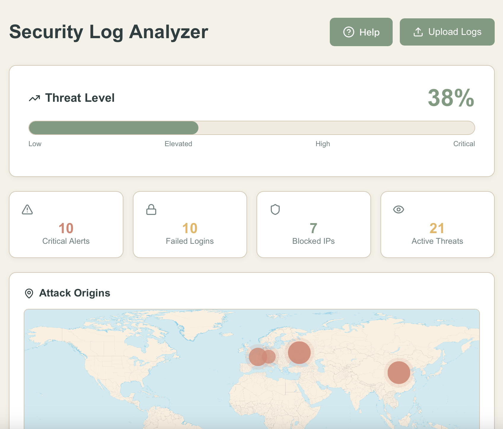

# Security Log Analyzer

A web-based tool for analyzing security logs and identifying potential threats. Built to practice security log analysis and incident response workflows.

[Live Website](https://avar777.github.io/Security-Log-Analyzer/)



## Background

During security incident response, analysts need to quickly assess log files from compromised systems to understand what happened. This tool simulates that workflow by parsing various log formats and identifying common attack patterns that would indicate a security incident.

## Threat Detection Capabilities

This analyzer identifies the following attack types commonly seen in the real-world:

**SQL Injection** - Detects attempts to manipulate database queries through user input. Looks for SQL keywords like UNION SELECT, DROP TABLE, and malformed queries in access logs.

**Brute Force Attacks** - Identifies multiple failed authentication attempts from the same IP address within a short time window. Threshold set at 3+ failures to reduce false positives from legitimate typos.

**Cross-Site Scripting (XSS)** - Flags attempts to inject malicious scripts through parameters. Searches for <script> tags and JavaScript event handlers in request paths.

**Port Scanning** - Detects reconnaissance activity where attackers probe for open services. Identifies patterns of sequential port access from single sources.

**Directory Traversal** - Catches attempts to access files outside web root using "../" sequences. This is often a precursor to more serious exploitation.

**DDoS Indicators** - Identifies abnormally high request volumes from single IPs that could indicate denial of service attacks or botnet activity.

**Command Injection** - Detects attempts to execute system commands through vulnerable input fields, often seen in RCE (Remote Code Execution) attacks.

## Why These Patterns Matter

Understanding these attack signatures is essential for security analysts because:

- **SQL Injection** remains in OWASP Top 10 and caused major breaches at Target, Heartland Payment Systems
- **Brute Force** is how attackers gain initial access in credential-stuffing campaigns
- **Port Scanning** appears in the reconnaissance phase of the cyber kill chain
- **XSS** enables session hijacking and is commonly used in phishing campaigns

The tool prioritizes these patterns because they represent the most common attack vectors analysts encounter during incident response.

## Threat Scoring Methodology

The analyzer calculates an overall threat level (0-100%) based on:

- **Severity weighting**: CRITICAL events contribute more to the score than LOW events
- **Frequency analysis**: Multiple attack attempts from same source increase score
- **Pattern diversity**: Different attack types from same IP suggest coordinated campaign

Scoring formula: `(critical × 10 + high × 5 + medium × 2) / (total events × 10) × 100`

This provides at-a-glance assessment similar to risk scoring in SIEM platforms.

## Use Cases for Security Analysts

**Incident Response**: Quickly triage log files from compromised servers to identify attack vectors and timeline

**Security Audits**: Review web server logs to find potential vulnerabilities being probed by attackers

**Threat Hunting**: Identify suspicious patterns that automated tools might miss

**Training**: Practice log analysis skills with sample datasets representing different threat scenarios

## Geographic Threat Intelligence

The world map visualization shows attack origin locations, helping analysts:
- Identify geographic patterns (are attacks coming from known threat actor regions?)
- Spot distributed attacks (attacks from multiple countries suggest botnet)
- Correlate with threat intelligence (is this IP range known for APT activity?)

This mirrors functionality in commercial SIEM platforms like Splunk or QRadar.

## Supported Log Formats

**Web Server Logs** (Apache/nginx):
```
45.142.120.10 - - [07/Jan/2026:14:23:45] "GET /admin' OR '1'='1 HTTP/1.1" 403
```

**SSH Authentication Logs**:
```
Jan 07 14:23:45 server sshd[1234]: Failed password for admin from 45.142.120.10
```

**Generic Security Logs**:
```
2026-01-07 14:23:45 [CRITICAL] SQL injection attempt from 45.142.120.10 (Russia)
```

The parser automatically detects format, similar to how SIEM tools normalize logs from different sources.

## Sample Datasets

The `/sample-logs` folder contains realistic scenarios:

- **logs-normal.txt** - Baseline legitimate traffic
- **logs-low-threat.txt** - Minor security events (failed logins from internal IPs)
- **logs-elevated-threat.txt** - Suspicious but not critical activity
- **logs-high-threat.txt** - Active exploitation attempts
- **logs-critical-threat.txt** - Confirmed breach indicators (malware, data exfiltration)

These represent the types of logs you'd analyze during different phases of an incident.

## Limitations and Real-World Considerations

**No Context Awareness**: The tool can't distinguish between legitimate admin activity and attacker commands. Real SOC analysts would correlate with user behavior baselines.

**False Positives**: Legitimate queries might contain SQL keywords. Production SIEM tools use machine learning to reduce false positive rates.

**Static Analysis Only**: Real-time monitoring and alerting would require backend infrastructure. This is designed for post-incident forensics.

**Limited Threat Intelligence**: Uses hardcoded geographic data. Enterprise tools integrate with feeds like AlienVault OTX or MISP for real-time threat correlation.

## What I Learned Building This

- How different attack patterns appear in logs (what SQL injection actually looks like vs theoretical knowledge)
- Why log normalization matters when dealing with multiple formats
- The balance between detection sensitivity and false positive rates
- How security analysts need both technical skills and investigative thinking

## Installation

```bash
git clone https://github.com/yourusername/security-log-analyzer.git
cd security-log-analyzer
npm install
npm start
```

## Future Enhancements

- **Correlation Rules**: Link related events (failed login followed by privilege escalation from same IP)
- **Timeline Visualization**: Show attack progression over time
- **IOC Extraction**: Automatically pull indicators of compromise (IPs, file hashes) for sharing
- **MITRE ATT&CK Mapping**: Tag detected techniques to the ATT&CK framework
- **Export Reports**: Generate incident reports in standard formats for documentation

## Technologies Used

React, JavaScript, CSS - chosen for client-side processing to maintain log privacy (no data sent to servers)

## Author

Ava Raper

## License

MIT
